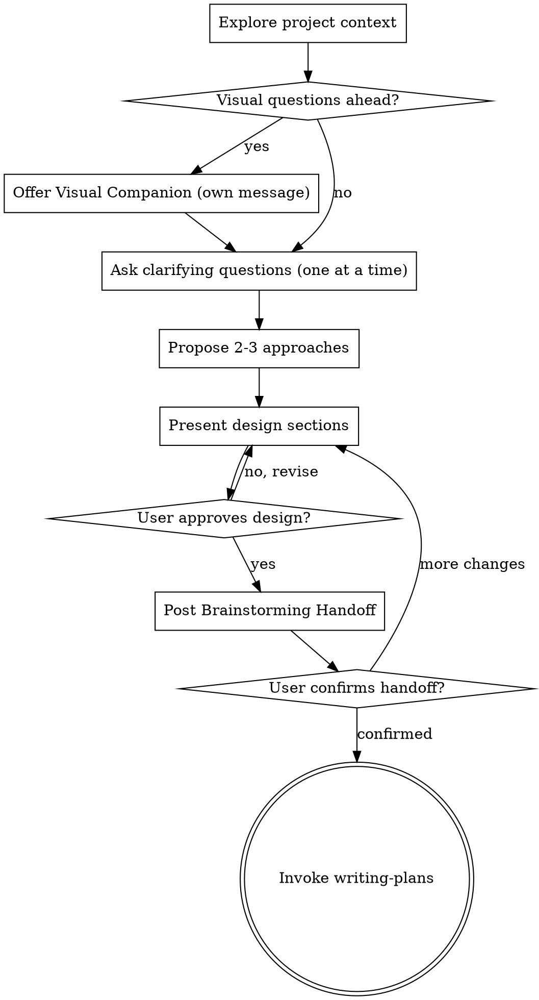

# Brainstorming Ideas Into Designs

Help turn ideas into fully formed designs through natural collaborative dialogue. The output is **conversation context**, not a separate spec document — `kryptonite:writing-plans` reads the dialogue and synthesizes the plan from it.

Start by understanding the current project context, then ask questions one at a time to refine the idea. Once you understand what you're building, present the design and get user approval before handing off.

<HARD-GATE>
Do NOT invoke any implementation skill, write any code, or scaffold any project until:
1. You have presented a design and the user has explicitly approved it
2. You hand off to `kryptonite:writing-plans` (the next skill in the pipeline)

This applies to EVERY project regardless of perceived simplicity.
</HARD-GATE>

**Validation lives downstream.** Brainstorming approves the *shape* of the work. `kryptonite:writing-plans` validates the *plan* with parallel validators. Don't conflate the two.

**Announce at start:** "I'm using the brainstorming skill to explore the design."

## Anti-Pattern: "This Is Too Simple To Need A Design"

Every project goes through this process. A todo list, a single-function utility, a config change — all of them. "Simple" projects are where unexamined assumptions cause the most wasted work. The design can be short (a few sentences for truly simple projects), but you MUST present it and get approval.

## Checklist

Create a TodoWrite task per item; complete in order:

1. **Explore project context** — check files, docs, recent commits
2. **Offer visual companion** (if topic will involve visual questions) — own message, no other content
3. **Ask clarifying questions** — one at a time; understand purpose, constraints, success criteria
4. **Propose 2–3 approaches** — with trade-offs and your recommendation
5. **Present design** — in sections scaled to their complexity, get user approval after each section
6. **Post the Brainstorming Handoff** — one final message with the structured block (verbatim user ask, goal, architecture, components, decisions reached, alternatives rejected, non-goals). See "The Brainstorming Handoff Block" section below for exact structure. This single block is both the close-out the user reads and the artifact `kryptonite:writing-plans` consumes.
7. **Hand off to `kryptonite:writing-plans`** — invoke the skill so it reads the conversation and synthesizes the plan

## Process Flow



**The terminal state is invoking `kryptonite:writing-plans`.** That's the only skill you invoke after brainstorming. `kryptonite:writing-plans` reads the conversation context — it does not need a separate spec doc.

## The Process

**Understanding the idea:**

- Check out the current project state first (files, docs, recent commits)
- Before asking detailed questions, assess scope: if the request describes multiple independent subsystems (e.g. "build a platform with chat, file storage, billing, and analytics"), flag this immediately. Don't spend questions refining details of a project that needs to be decomposed first.
- If the project is too large for a single plan, help the user decompose into sub-projects: what are the independent pieces, how do they relate, what order should they be built? Brainstorm the first sub-project through the normal flow. Each sub-project gets its own plan and execution cycle.
- For appropriately-scoped projects, ask questions one at a time
- Prefer multiple choice questions when possible, but open-ended is fine
- Only one question per message — if a topic needs more exploration, break it into multiple questions
- Focus on: purpose, constraints, success criteria

**Exploring approaches:**

- Propose 2–3 different approaches with trade-offs
- Present options conversationally with your recommendation and reasoning
- Lead with your recommended option and explain why

**Presenting the design:**

- Once you understand what you're building, present the design **in chat** (no separate file)
- Scale each section to its complexity: a few sentences if straightforward, up to 200–300 words if nuanced
- Ask after each section whether it looks right so far
- Cover: architecture, components, data flow, error handling, testing strategy
- Be ready to go back and clarify if something doesn't make sense

**Design for isolation and clarity:**

- Break the system into smaller units that each have one clear purpose, communicate through well-defined interfaces, and can be understood and tested independently
- For each unit, you should be able to answer: what does it do, how do you use it, what does it depend on?
- Can someone understand what a unit does without reading its internals? Can you change the internals without breaking consumers? If not, the boundaries need work.
- Smaller, well-bounded units are also easier for `kryptonite:coordinating-agent-teams` to parallelize: fine-grained components map cleanly to teammates and groups.

**Working in existing codebases:**

- Explore the current structure before proposing changes; follow existing patterns
- Where existing code has problems that affect the work (e.g. a file too large, unclear boundaries), include targeted improvements as part of the design — the way a good developer improves code they're working in
- Don't propose unrelated refactoring; stay focused on what serves the current goal

## Handoff to writing-plans

Once the design is approved:

1. **Post the Brainstorming Handoff block** in chat (one final message). See "The Brainstorming Handoff Block" section below for the exact structure. This block is both the close-out the user reads and the artifact `kryptonite:writing-plans` consumes — there is no separate conversational recap.
2. **Ask the user to confirm:** "Ready to hand off to `kryptonite:writing-plans` to synthesize the implementation plan?"
3. On confirmation: invoke `kryptonite:writing-plans`. It reads this conversation, synthesizes the plan, runs parallel validators, and presents a decision point (agent team or inline execution).

Do NOT write a separate spec document. Do NOT commit anything to git at this stage. The conversation IS the artifact `kryptonite:writing-plans` reads.

## Key Principles

- **One question at a time** — don't overwhelm with multiple questions
- **Multiple choice preferred** — easier to answer than open-ended when possible
- **YAGNI ruthlessly** — remove unnecessary features from all designs
- **Explore alternatives** — always propose 2–3 approaches before settling
- **Incremental validation** — present design, get approval before moving on
- **Be flexible** — go back and clarify when something doesn't make sense
- **Conversation is the artifact** — no separate spec doc; `kryptonite:writing-plans` reads the dialogue

## Visual Companion

A browser-based companion for showing mockups, diagrams, and visual options during brainstorming. Available as a tool — not a mode. Accepting the companion means it's available for questions that benefit from visual treatment; it does NOT mean every question goes through the browser.

**Offering the companion:** When you anticipate that upcoming questions will involve visual content (mockups, layouts, diagrams), offer it once for consent:
> "Some of what we're working on might be easier to explain if I can show it to you in a web browser. I can put together mockups, diagrams, comparisons, and other visuals as we go. This feature is still new and can be token-intensive. Want to try it? (Requires opening a local URL)"

**This offer MUST be its own message.** Do not combine it with clarifying questions, context summaries, or any other content. The message should contain ONLY the offer above and nothing else. Wait for the user's response before continuing. If they decline, proceed with text-only brainstorming.

**Per-question decision:** Even after the user accepts, decide FOR EACH QUESTION whether to use the browser or the terminal. The test: **would the user understand this better by seeing it than reading it?**

- **Use the browser** for content that IS visual — mockups, wireframes, layout comparisons, architecture diagrams, side-by-side visual designs
- **Use the terminal** for content that is text — requirements questions, conceptual choices, tradeoff lists, A/B/C/D text options, scope decisions

A question about a UI topic is not automatically a visual question. "What does personality mean in this context?" is a conceptual question — use the terminal. "Which wizard layout works better?" is a visual question — use the browser.

If they agree to the companion, read the detailed guide before proceeding:
`skills/brainstorming/visual-companion.md`

## Integration

**Calls:** `kryptonite:writing-plans` (the only downstream skill from brainstorming)
**Pairs with:** `kryptonite:using-kryptonite` (skill discovery), `kryptonite:writing-plans` (synthesizes the plan from this conversation)

## The Brainstorming Handoff Block

This is the single artifact that closes the brainstorming conversation. It plays two roles at once:

- **Close-out for the user** — covering goal, architecture, components, and the decisions you reached together. The user reads this to confirm the brainstorm landed where they expected before handing off.
- **Structured handoff for `kryptonite:writing-plans`** — the verbatim user ask and the decisions/alternatives/non-goals become source-of-truth values for validator slots downstream.

There is no separate conversational recap. This block IS the recap.

The conversation is the broader artifact, but `kryptonite:writing-plans` dispatches validators as **fresh subagents** that have no access to this conversation. The lead must hand specific values into validator prompts (notably `scope-prompt.md`'s `[USER_REQUEST_VERBATIM]` and `[BRAINSTORM_DECISIONS]` slots). If the conversation gets compressed later, those values are gone unless you've preserved them in this block.

**Before invoking `kryptonite:writing-plans`, post one final message (no separate file) with this exact structure:**

```
## Brainstorming Handoff

### User's original ask (verbatim)
> <paste the user's first message that kicked off this work, word-for-word, in a quote block. If the request was refined across multiple messages, quote the most complete restatement the user themselves wrote — not your paraphrase.>

### Goal
<one sentence — what this builds and why>

### Architecture
<2–3 sentences — the approach>

### Components
- <component>: <one-line responsibility>
- <component>: <one-line responsibility>
- ...

### Decisions reached
- <decision 1: what we picked, in one sentence>
- <decision 2>
- <decision 3>
- ...

### Alternatives rejected
- <alternative 1>: <one-sentence reason>
- <alternative 2>: <one-sentence reason>
- ...

### Non-goals (explicitly out of scope)
- <thing the user mentioned but doesn't want now, if any>
```

This block becomes the source of truth the lead in `kryptonite:writing-plans` pastes into validator slots:
- The verbatim quote → `[USER_REQUEST_VERBATIM]`
- The decisions + rejected alternatives + non-goals → `[BRAINSTORM_DECISIONS]`

Post this **immediately before** invoking `kryptonite:writing-plans`. Do not skip it for "small" projects — the validator pipeline runs the same way regardless of project size, and a lead who can't find the verbatim ask will reconstruct it from memory and get it subtly wrong.

**`kryptonite:writing-plans` will copy this block into the plan doc as its first action.** Once it's in the plan doc, that copy is the source of truth for validator slot substitution — the chat copy still serves human reference, but if the conversation compresses, the plan doc preserves the verbatim ask.
