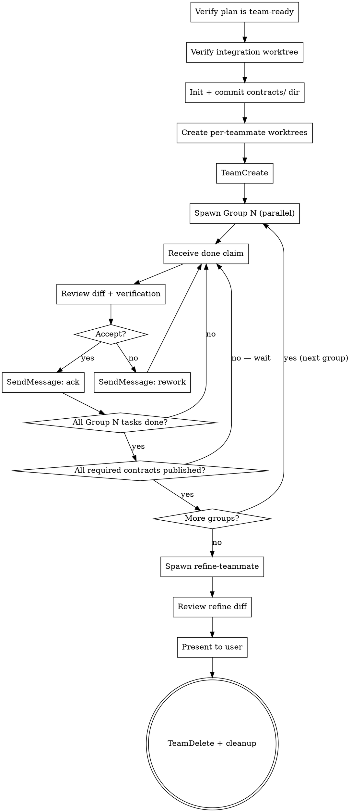

# Coordinating Agent Teams

Sets up and runs a multi-agent implementation of a validated plan. The lead (you) is **purely supervisory** — never implements. Teammates implement in isolated worktrees, communicate via three channels, and dissolve when done.

<HARD-GATE>
Do NOT spawn a team until ALL of:
1. You are inside the feature worktree `kryptonite:writing-plans` created (its Step 1). That worktree's branch (`feature/<name>`) is now the integration branch.
2. Plan exists at `docs/plans/YYYY-MM-DD-<feature>.md` inside that worktree and validators have cleared (writing-plans complete)
3. Plan has a populated `## Parallelization Map` with **groups, ownership table, and inter-group contracts**
4. User has explicitly chosen "agent team" at the writing-plans decision point
</HARD-GATE>

**Validation lives in the main chat only — never re-validate inside the team.** Teammates implement; you validate.

**Announce at start:** "I'm using the coordinating-agent-teams skill to spin up the team."

## Preflight: tmux check

Long-lived team work benefits from tmux. The team may run for tens of minutes; tmux lets the user detach/reattach without losing state, gives them separate windows to monitor teammates while keeping the lead session in view, and preserves work if SSH drops or the laptop sleeps.

Before doing anything else (BEFORE worktree setup, BEFORE TeamCreate), run:

```bash
if [ "${KRYPTONITE_SKIP_TMUX_CHECK:-}" = "1" ]; then
  echo "tmux check skipped (KRYPTONITE_SKIP_TMUX_CHECK=1)"
elif [ -n "$TMUX" ]; then
  echo "in tmux"
else
  echo "NOT in tmux"
fi
```

Set `KRYPTONITE_SKIP_TMUX_CHECK=1` to skip this check permanently — for users who never use tmux.

**If not in tmux**, surface this to the user and wait for confirmation:

> Heads up — you're about to spawn a long-lived agent team that may run for several minutes or longer. I noticed you're not in a tmux session.
>
> Strongly recommended: detach now, start tmux (`tmux new -s <feature>`), and restart this command from inside the session. tmux lets you detach/reattach without losing the team's state and gives you separate windows for monitoring teammates.
>
> Continue without tmux anyway?

Wait for an explicit "yes / continue" response before proceeding. Do NOT infer consent. If they want to switch to tmux, stop cleanly — no worktrees created yet, nothing to undo.

## What you (the lead) do and don't do

| You DO | You DO NOT |
|---|---|
| Set up integration branch + per-teammate worktrees | Write or edit any code in any worktree |
| Spawn teammates by group, in dependency order | Pick up unclaimed tasks (that's a coordination signal, not a free task) |
| Review **every** done claim before marking complete | Re-validate the plan (validation lived in writing-plans) |
| Receive `SendMessage` from teammates; arbitrate scope/plan questions | Run `kryptonite:refine` yourself (the refine-teammate runs it; you confirm) |
| Spawn the refine-teammate at the end and confirm its report | Auto-commit or push the integration branch into main (per global CLAUDE.md) |
| Run `TeamDelete` and clean up worktrees | Skip the contract checkpoint between groups |

## Checklist

Create a TodoWrite task per item and complete in order:

1. **Verify the plan is team-ready** — parallelization map, groups, ownership table, inter-group contracts all populated
2. **Verify the integration worktree** — you should already be in the feature worktree `kryptonite:writing-plans` created (its Step 1). That worktree on `feature/<name>` is now the integration worktree; you do NOT create a new one. The plan doc is already committed there (writing-plans committed it at the decision point).
3. **Initialize the `contracts/` directory** on the integration branch
4. **Commit `contracts/` to the integration branch** — `git -C <integration-worktree> add contracts/ && git -C <integration-worktree> commit -m "init: contracts dir"`. This puts the directory on the branch so per-teammate worktrees (created in step 5) inherit it. The plan doc is already on the branch from writing-plans.
5. **Create per-teammate worktrees** via `kryptonite:using-git-worktrees`, branched from `feature/<name>` (now they inherit plan + `contracts/`)
6. **`TeamCreate`** to establish the team, then **spawn Group 1** with `Agent` calls (one per teammate, in a single message, `run_in_background: true`)
7. **Receive done claims, review each, send ack or rework**
8. **At each Group N → N+1 boundary, verify all required contracts are present on integration**
9. **Spawn Group N+1**; repeat 7–8 until all groups done
10. **Spawn refine-teammate** to run the `kryptonite:refine` skill on a worktree off the integration branch
11. **Confirm refine report**, present integration diff to the user for review
12. **`TeamDelete`**, then hand off to `kryptonite:finishing-a-development-branch` for worktree, branch, and plan-doc cleanup (don't clean those up here — that skill owns them and handles both topologies)

## Process Flow



## Pre-spawn validation

The plan must contain these three pieces. If any are missing, STOP and return to `kryptonite:writing-plans`.

```markdown
## Parallelization Map

### Groups
- **Group 1 (parallel):** Component A, Component B
- **Group 2 (depends on Group 1 contracts):** Component C
- **Group 3 (depends on Group 2):** Component D

### Ownership
| Component | Owner (teammate name) |
|---|---|
| Component A | backend |
| Component B | frontend |
| Component C | integration |
| Component D | tests |

### Inter-group contracts
- **Group 1 → Group 2:** `backend` publishes `contracts/api-schema.md`; `frontend` publishes `contracts/ui-events.md`
- **Group 2 → Group 3:** `integration` publishes `contracts/wire-format.md`
```

## Worktree and branch layout

The integration worktree already exists — `kryptonite:writing-plans` created it on `feature/<feature>` as its first step, and you're inside it now. You add per-teammate worktrees alongside it (defer placement to `kryptonite:using-git-worktrees`):

```
<worktree-dir>/<feature>/             # branch: feature/<feature>           ← integration worktree (exists; from writing-plans)
<worktree-dir>/<feature>-<owner1>/    # branch: feature/<feature>/<owner1>  ← teammate 1 (NEW)
<worktree-dir>/<feature>-<owner2>/    # branch: feature/<feature>/<owner2>  ← teammate 2 (NEW)
...
```

Every teammate branch is created off `feature/<feature>` AFTER `contracts/` is committed (checklist step 4) — that way each teammate worktree inherits both the plan doc (already on the branch from writing-plans) and the contracts directory. Per-teammate worktree directories use the same parent directory `kryptonite:using-git-worktrees` chose during writing-plans Step 1.

`contracts/` lives on the integration branch and is the **only** path teammates may write to outside their own worktree.

## Spawning teammates

Each teammate is **long-lived**, not a one-shot subagent. Use `Agent` with:

- `subagent_type: "general-purpose"`
- `team_name: "<owner-name>"` — makes them addressable via `SendMessage`
- `name: "<owner-name>"` — same name for human readability
- `run_in_background: true` — multiple teammates run concurrently while you interleave reviews
- Do NOT pass `isolation: "worktree"` — you've already created the worktree manually
- `prompt`: the briefing template below

**Team lifecycle:** there is exactly one team per run. `TeamCreate` (step 6 of the checklist) establishes it; every subsequent `Agent` call with a `team_name` — including teammates spawned later in dependent groups, and the `refine-teammate` at the end — joins that same team. `team_name` labels the teammate for SendMessage routing, not a separate team. `TeamDelete` (step 12) tears the whole team down once. Do NOT call `TeamCreate` again mid-run.

Spawn ALL teammates in a group **in a single message** (multiple `Agent` tool uses in parallel).

### Briefing template

```markdown
You are the **<owner-name>** teammate on the **<feature>** team.

You are NOT a one-shot subagent. You are a long-lived implementation agent that works iteratively with the lead and your peers. You may receive multiple `SendMessage`s during your run; respond to each before continuing.

## Your worktree
`<absolute-path>` — `cd` here for ALL file operations. Do NOT touch any other worktree.

## Your branch
`feature/<feature>/<owner-name>` — commit here only. Do NOT push to integration or main.

## Your tasks
Read `docs/plans/<feature>.md` in full before starting. From the ownership table, you own:
- <Component name>
- <Component name>

Components you don't own belong to other teammates — do not implement them.

## How to communicate

| Need | Channel |
|---|---|
| Plan/scope question, "I think my task is wrong", blocked on lead, request to spawn a peer | `SendMessage` to lead |
| Technical question for another teammate ("what field name?", "ETA on contract X?", "rename Y?") | `SendMessage` directly to that teammate by name (see ownership table) |
| Publishing an interface contract for downstream teammates | Write to `contracts/<thing>.md` and notify per **Contract publishing protocol** below |

## Contract publishing protocol
If your task includes publishing a contract:
1. Write `contracts/<thing>.md` in YOUR worktree
2. Commit: `contracts: publish <thing>`
3. `SendMessage` lead: `Contract ready: contracts/<thing>.md` — lead fast-forwards integration
4. `SendMessage` consuming teammates (per inter-group contracts in plan): `Contract published: contracts/<thing>.md`

## Skills you MUST use (always invoke via the `Skill` tool with the `kryptonite:` prefix)

(The `kryptonite:` prefix is explicit so it resolves unambiguously when other skill plugins are installed alongside kryptonite. With only kryptonite installed, the prefix still resolves correctly.)

- `kryptonite:test-driven-development` — every component
- `kryptonite:verification-before-completion` — before claiming done
- `kryptonite:systematic-debugging` — when anything fails
- `kryptonite:dispatching-parallel-agents` — for one-shot helpers (research, parallel test runs)

## Skills you MUST NOT use
- `kryptonite:coordinating-agent-teams` — no nested teams
- `kryptonite:writing-plans` — don't re-plan; ask lead if you think the plan is wrong
- `kryptonite:brainstorming` — design happened upstream

## Done claim protocol
When you finish a task:
1. Run verification per the plan's "Verification" section
2. Commit your work
3. `SendMessage` lead: `Task <name> done. Verification: <output>. Branch: <branch>.`
4. **Wait for ack** before starting the next task

## Stop conditions
- Lead sends `stand by` → finish current edit, commit, wait
- Lead sends `rework <task>: <issue>` → fix per instruction; do not start new work
- All your tasks done and lead acks → idle until final dismissal
```

## Group-by-group spawning

In each group:

1. Spawn ALL teammates in the group in one message (parallel `Agent` calls, `run_in_background: true`)
2. Watch `SendMessage` and `TaskOutput` for activity
3. Process each done claim using the **Reviewing a done claim** protocol below
4. When all Group N tasks are acked AND all Group-N→N+1 contracts are present, spawn Group N+1

The research is clear: spawning Group N+1 before Group N publishes its contracts wastes compute and degrades quality. Wait for the checkpoint.

## Reviewing a done claim (lead protocol)

For **every** done claim:

1. `git -C <teammate-worktree> diff main...HEAD` — read the actual changes
2. Cross-check against the plan's component contract for that task
3. Verify the verification: did the teammate run what the plan said? Re-run the cheap parts yourself; don't trust pasted output blindly
4. **If the change crosses an integration boundary** (touches a published contract or a file another teammate also touched): re-read the contract and confirm consistency
5. Decision:
   - **Accept** → `SendMessage` ack: `ack <task>; ok to take next task` → mark complete in shared task list
   - **Rework** → `SendMessage`: `<task>: <specific issue>; please fix and re-claim`
   - **Escalate** → if accept/rework is unclear, surface to user before responding

The lead is the bottleneck on done claims by design. Skipping review is the #1 multi-agent failure mode.

## Inter-group checkpoint

Before spawning Group N+1, verify the contracts Group N owed are on integration:

```bash
git -C <integration-worktree> log --oneline -- contracts/
git -C <integration-worktree> ls-files contracts/
```

If a required contract is missing: do NOT spawn Group N+1. `SendMessage` the responsible teammate for status.

## The refine pass

When all groups are done:

1. Create a fresh worktree off integration: `<worktree-dir>/<feature>-refine/` on branch `feature/<feature>/refine`
2. Spawn `refine-teammate` (`Agent` with `team_name: "refine"`, `run_in_background: true`) with this briefing. The refine-teammate joins the existing team established at step 6 — do NOT call `TeamCreate` again:

   > Run the `kryptonite:refine` skill on this worktree. The skill dispatches three parallel reviewers (code reuse, code quality, efficiency) and applies the surviving findings. **Do NOT change behavior** — refine is structural only. Commit your changes and `SendMessage` lead a summary of what you changed and what you deliberately left alone.

3. When refine-teammate claims done: review its diff using the same done-claim protocol
4. Merge `feature/<feature>/refine` back into `feature/<feature>` (the integration branch)
5. `SendMessage` refine-teammate dismissal

## Wrap-up

After refine lands on integration:

1. Show the user:
   - Total integration diff: `git diff main...feature/<feature>`
   - Test status on integration
   - Per-teammate contribution summary
2. **Stop.** Per the user's CLAUDE.md, do NOT auto-commit, merge, or push. The user reviews and instructs.
3. Once the user signals satisfaction with the integration branch:
   - **`TeamDelete`** to dissolve the team — do this BEFORE handing off to the closing skill, so background teammates aren't running while you're walking through integration choices.
   - **Hand off to `kryptonite:finishing-a-development-branch`.** That skill detects the team topology (integration branch + per-teammate sub-branches + multiple worktrees), verifies every worktree is clean and the integration branch is green, presents integration options (PR / merge / squash / hand off), and drives cleanup of all worktrees, the per-teammate branches, the refine branch, and the plan doc — without auto-committing, auto-pushing, or auto-merging.

Don't drive integration or cleanup decisions from this skill — `kryptonite:finishing-a-development-branch` is the single closing skill that handles both inline and team topologies. Your job ends at `TeamDelete` + handoff.

## Failure modes and recovery

| Symptom | Diagnosis | Fix |
|---|---|---|
| Teammate silent for a long stretch | Hung or stuck on a tool call | `TaskOutput` to peek; if truly stuck, `TaskStop` and respawn from a fresh task with the same briefing |
| Two teammates touched the same file | Plan decomposition was wrong | Pause both (`SendMessage stand by`), surface to user, revise plan, then resume |
| Done claim's verification doesn't match the diff | Fabricated success | Rework: send the exact verification command; require its real output |
| Contract published but consumer produces incompatible code | Contract was ambiguous | Plan defect. Pause both, fix the contract on integration, re-spawn the consumer's task with the corrected contract |
| Lead inbox is overwhelming | Too many teammates or tasks too fine-grained | Note for the next plan's parallelization-analyzer pass; don't dissolve mid-run |
| Teammate tries to invoke `kryptonite:coordinating-agent-teams` or `kryptonite:writing-plans` | Briefing failure | Re-send briefing; if it persists, `TaskStop` and respawn |

## Anti-patterns

- **Lead implements** — even one edit. Once the lead implements, it loses overview. Unclaimed tasks are a coordination problem, not free tasks.
- **Skipping done-claim review** — silent regressions are the #1 multi-agent failure mode.
- **Spawning all groups at once** — research shows 39–70% degradation on sequentially-dependent tasks in multi-agent setups. Spawn by group with contract checkpoints.
- **Letting teammates push to main or integration** — teammates push to their own branch only. Lead controls integration.
- **Forgetting `TeamDelete`** — leaves teammates running and billing in the background.
- **Re-validating the plan inside the team** — validation belongs to `kryptonite:writing-plans` in the main chat. The team implements.

## Integration

**Called by:** `kryptonite:writing-plans` (decision point: "agent team")
**Calls:** `kryptonite:using-git-worktrees` (worktree placement), `kryptonite:refine` (run by refine-teammate before `TeamDelete`)
**Closing pass:** after `TeamDelete`, hand off to `kryptonite:finishing-a-development-branch` — it owns integration choice and cleanup for both inline and team topologies
**Teammates internally use:** `kryptonite:test-driven-development`, `kryptonite:verification-before-completion`, `kryptonite:systematic-debugging`, `kryptonite:dispatching-parallel-agents`
