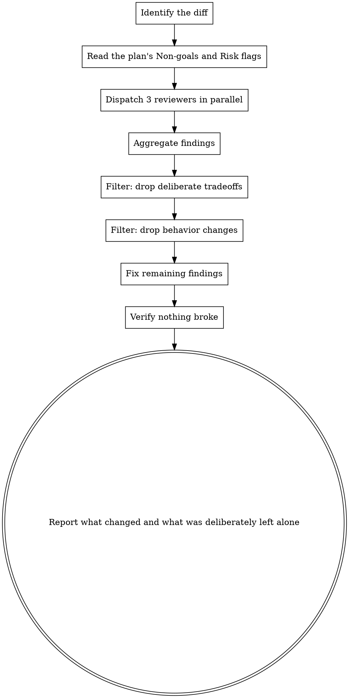

# Refine

Polish the implementation diff before handing it to the user. Three parallel reviews, then fix findings inline. **Behavior must not change.** Refine smooths edges; it does not redesign.

**Announce at start:** "I'm using the refine skill to review and polish the changes."

## When to run

This is the closing pass for kryptonite execution paths:

- `kryptonite:executing-plans` — after every component is implemented and verified
- `kryptonite:coordinating-agent-teams` — run by the dedicated `refine-teammate` against the integration branch (the lead spawns it, doesn't run refine itself)

Don't run refine until all components' Verification blocks have passed. Refining a red implementation just polishes a broken result.

## The hard rule: no behavior changes

Refine is structural — naming, organization, dead-code removal, consolidation, parallelism, idiom alignment. It is **not** redesign, scope expansion, or "while we're in here" feature additions. If a finding requires a behavior change to fix, surface it to the user instead of fixing it.

This rule matters most in team mode: the `refine-teammate`'s commits get merged back into integration without re-running every component's spec/quality reviewer. A behavior-changing refine commit slips past every gate.

## The Process



## Phase 1: Identify the diff

The diff scope depends on which workflow called you:

| Caller | Diff command |
|---|---|
| `kryptonite:executing-plans` (inline) | `git diff main...HEAD` from the feature worktree |
| `kryptonite:coordinating-agent-teams` (run by `refine-teammate`) | `git diff main...HEAD` from the refine worktree (which is branched off integration) |
| Direct invocation, no plan | `git diff` for unstaged, `git diff --staged` for staged, `git diff main...HEAD` if on a feature branch — pick whichever matches the user's intent |

If there are no git changes, fall back to the most recently edited files the user mentioned. Don't refine a clean tree silently.

## Phase 2: Read the plan's deliberate decisions

If a plan doc exists at `docs/plans/YYYY-MM-DD-<feature>.md`, read these sections before dispatching reviewers:

- **Non-goals** — features the plan explicitly excluded. Don't let a reviewer add them back.
- **Risk flags** (per component) — accepted risks. A "destructive: rebuilds the index" flag means index-rebuild behavior is *intentional*, not a bug to fix.
- **Implementation notes** — when a component's notes say "use library X" or "follow pattern Y," that's a settled decision. Don't re-litigate it during refine.

You'll pass these sections to each reviewer as guardrails.

## Phase 3: Dispatch three reviewers in parallel

Use `kryptonite:dispatching-parallel-agents` for the fan-out: one message, three `Agent` calls, all `run_in_background: false`.

Each reviewer gets:
1. The full diff
2. The plan's Non-goals and Risk flags (if a plan exists)
3. The reviewer-specific prompt (one of the three below)

Prompt templates:
- `./code-reuse-prompt.md`
- `./code-quality-prompt.md`
- `./efficiency-prompt.md`

## Phase 4: Aggregate and filter findings

Collect the three reports, then filter:

1. **Drop deliberate tradeoffs.** If a finding contradicts the plan's Non-goals, Risk flags, or settled Implementation notes, drop it.
2. **Drop behavior changes.** If fixing a finding would alter observable behavior — return values, side effects, error modes, performance characteristics that are part of the contract — drop it from the fix list and surface it to the user instead.
3. **De-duplicate.** Three reviewers sometimes flag the same issue from different angles. Pick the clearest framing and merge.
4. **Note false positives** — don't argue with the reviewer; just skip and note in the report.

What survives all four filters is the fix list.

## Phase 5: Fix the surviving findings

Apply fixes inline (refine is a single-session activity, not a hand-off). Group commits by category if there's volume — one commit per category beats one giant "refine pass" commit.

Per the user's CLAUDE.md, do NOT auto-commit unless the user has asked you to commit during this session. In team mode the `refine-teammate` IS authorized to commit (the lead's briefing makes that explicit), but in solo mode, stage the changes and let the user commit.

## Phase 6: Verify nothing broke

Use `kryptonite:verification-before-completion` discipline:

1. Re-run every component's Verification block (or the plan's top-level verification, whichever applies)
2. Run the full test suite
3. Confirm green before claiming refine is done

If a refine fix broke a test, you've violated the no-behavior-change rule. Revert that specific fix and surface it to the user.

## Phase 7: Report

Tell the user (or in team mode, `SendMessage` the lead):

- **Categories addressed** — code reuse, quality, efficiency
- **Fixes applied** — short list, grouped by category
- **Deliberately left alone** — findings that were behavior changes or contradicted the plan, with one-line justification each. The user (or lead) decides whether to revisit.
- **Verification result** — confirmed green

In **solo mode**, end the report with an explicit reminder:

> Refine staged N changes. **Commit them before invoking `kryptonite:finishing-a-development-branch`** — that skill verifies a clean working tree in Step 1 and will refuse to proceed otherwise. Suggested commit:
>
> ```bash
> git add -A
> git commit -m "refine: <one-line summary>"
> ```

In team mode, the `refine-teammate` is authorized to commit (per the lead's briefing), so this reminder doesn't apply — the lead receives a normal done-claim.

Keep it short. The diff itself is the long-form artifact.

## Three reviewer prompts

Each reviewer is a one-shot subagent. The full prompt templates live alongside this skill so the dispatching code stays compact.

### Reuse reviewer (`./code-reuse-prompt.md`)

Looks for: new code that duplicates existing utilities; inline logic that could use a project helper; reinventions of patterns already used elsewhere in the codebase.

### Quality reviewer (`./code-quality-prompt.md`)

Looks for: redundant state, parameter sprawl, copy-paste with slight variation, leaky abstractions, stringly-typed code, unnecessary nesting/wrapping, deep conditional chains, comments that narrate WHAT instead of WHY.

### Efficiency reviewer (`./efficiency-prompt.md`)

Looks for: redundant work, missed concurrency, hot-path bloat, recurring no-op updates, TOCTOU existence checks, memory leaks, overly broad operations.

## Red flags

**Never:**
- Run refine before all Verification blocks have passed
- Change observable behavior — return values, side effects, error modes, performance characteristics covered by the contract
- Reintroduce features the plan listed under Non-goals
- "Improve" code outside the diff (scope creep — pre-existing issues are out of scope)
- Skip Phase 6 verification — refine must leave the tree green
- In team mode: ignore the lead's done-claim review protocol — the lead reviews refine's diff just like any other teammate's

**If a reviewer surfaces a behavior change disguised as a refactor** (e.g., "this catch block swallows errors — remove it"): surface to the user, don't apply. Error-handling shape is part of the contract.

**If three reviewers contradict each other** (one wants more abstraction, another wants less): pick neither. Surface the disagreement to the user; the plan's Implementation notes likely settle it.

## Integration

**Required workflow skills:**
- **dispatching-parallel-agents** — for the three-reviewer fan-out
- **verification-before-completion** — for Phase 6

**Called by:**
- **executing-plans** — closing pass after inline execution
- **coordinating-agent-teams** — run by the dedicated `refine-teammate` before integration is presented to the user
