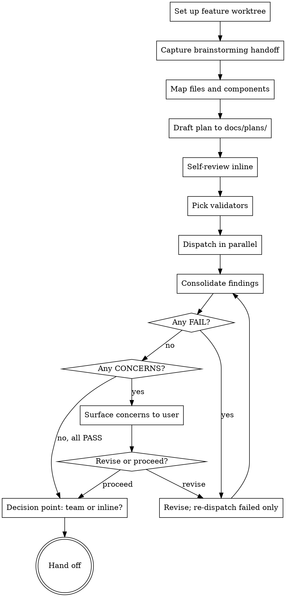

# Writing Plans

This skill produces ONE artifact — a spec with implementation notes — that's the contract between planning and execution. Every kryptonite execution path (agent team or inline) consumes this same plan.

The plan is **prose with structure**, not pseudocode. It tells an implementer what the contract is, what to touch, what tricky bits to know, and how to verify — without dictating exact code. Teammates and inline executors are full Claude sessions with judgment; they need direction, not a checkbox script.

<HARD-GATE>
Do NOT write code, dispatch executors, or spawn an agent team until:
1. The feature worktree is set up (Step 1 of the checklist)
2. The hybrid plan is written to docs/plans/YYYY-MM-DD-<feature>.md inside that worktree
3. The selected validators have returned PASS (or CONCERNS the user has explicitly acknowledged)
4. The user has chosen "agent team" or "inline" as the execution path

This applies to EVERY project regardless of perceived simplicity.
</HARD-GATE>

**Validation lives in the main chat only.** Never re-validate inside an agent team. Teammates implement; the lead validates.

**Announce at start:** "I'm using the writing-plans skill to write the implementation plan."

## Checklist

You MUST create a task for each of these items and complete them in order:

1. **Set up the feature worktree** — invoke `kryptonite:using-git-worktrees` to create a worktree on a new `feature/<name>` branch. Planning, execution, refine, and finishing all happen inside this worktree. `cd` into it before continuing — every subsequent path is relative to this worktree.
2. **Capture brainstorming handoff into plan doc** — copy the brainstorming handoff block from chat into the plan doc's `## Brainstorming Handoff` section (see plan structure below). This must happen BEFORE validator dispatch — they read from the plan doc, not chat. If brainstorming did not precede this plan, write `(no brainstorming preceded this plan)` under the section.
3. **Map files and components** — decide what gets touched and how it splits
4. **Draft the plan** and save to `docs/plans/YYYY-MM-DD-<feature>.md` (path relative to the feature worktree)
5. **Self-review** (inline, fresh eyes — fix obvious junk before spending validator tokens)
6. **Pick validators** based on what the plan touches
7. **Dispatch validators in parallel** — read `./validators/_dispatch.md` first for slot-substitution discipline
8. **Consolidate findings**, revise if needed, re-dispatch only the failed validators
9. **Loop 7–8** until all PASS (or remaining are CONCERNS the user has acknowledged)
10. **Decision point** — ask "agent team or inline?" and hand off

## Process Flow



## File Structure

Before drafting, map out which files will be created or modified and what each is responsible for. This is where decomposition gets locked in.

- Each component should have one clear responsibility
- Files that change together live together — split by responsibility, not by technical layer
- In existing codebases, follow established patterns; don't unilaterally restructure
- Smaller, focused files are easier to reason about and edit reliably

This structure informs how you split the plan into Component sections, and it's what the parallelization-analyzer reads when deciding team decomposition.

## The Plan Document

**Save to:** `docs/plans/YYYY-MM-DD-<feature>.md`

### Header

```markdown
# <Feature Name>

**Goal:** one sentence — what this builds and why
**Architecture:** 2–3 sentences — the approach
**Tech stack:** key libs, frameworks, services
**Non-goals:** what we are explicitly NOT building (scope-creep insurance)

## Brainstorming Handoff
*(verbatim copy of the Brainstorming Handoff block from chat; if no brainstorming preceded this plan, write "(no brainstorming preceded this plan)")*

### User's original ask (verbatim)
> <verbatim user ask>

### Goal
<one sentence — what this builds and why>

### Architecture
<2–3 sentences — the approach>

### Components
- <component>: <one-line responsibility>

### Decisions reached
- <decision>

### Alternatives rejected
- <alternative>: <reason>

### Non-goals (explicitly out of scope)
- <thing>

## Parallelization Map
*(filled in by parallelization-analyzer if dispatched; otherwise leave empty)*

---
```

### Per-component sections

```markdown
## Component: <name>

**Goal:** one sentence
**Public interface / contract:** inputs, outputs, side effects, error modes
**Touches files:** paths only — no line numbers, they rot
**Dependencies:** other components or services this consumes
**Implementation notes:** prose. Approach, libs, tricky bits, decisions already made.
   No code unless literal content is required (SQL schema, exact API payload, env var names).
**Verification:** how we'll know it's done — tests to add, commands to run, output to check
**Risk flags:** destructive ops, novel patterns, hidden assumptions
**Compat-shim ledger:** any deprecation markers, shims, or compat-only code introduced by this component
   (matches the `DEPRECATED|SHIM|TODO:compat` grep that `kryptonite:finishing-a-development-branch` runs in
   Step 1.5c). Name the marker, the file it lives in, and which component / future task is responsible for
   removing it. Leave empty if none.
```

## Plan-doc lifecycle

The plan doc at `docs/plans/YYYY-MM-DD-<feature>.md` is a working artifact for one feature's implementation, not a permanent record. It lives inside the feature worktree this skill creates in Step 1; both execution paths and the closing skill operate inside that same worktree. Ownership across the kryptonite workflow:

- **Created by:** this skill (`kryptonite:writing-plans`), inside the feature worktree, and **committed at the decision point** once the user picks team or inline. Both execution paths inherit it from `feature/<name>`.
- **Read by:** `kryptonite:executing-plans` (inline execution), `kryptonite:coordinating-agent-teams` (team execution — per-teammate worktrees branch off `feature/<name>` and inherit the committed doc), and `kryptonite:refine` (reads Non-goals + Risk flags as guardrails).
- **Updated by:** `kryptonite:executing-plans` and `kryptonite:coordinating-agent-teams` if a contract revision is needed mid-implementation. The plan doc stays the source of truth — update it (and commit the update) before continuing.
- **Deleted by:** `kryptonite:finishing-a-development-branch`, after integration is decided and with explicit user confirmation. For Option 1 (PR), deletion happens *before* PR creation so the plan doc doesn't ship in the PR. For Options 2/3/4, deletion happens during cleanup. No other skill deletes the plan doc; users who want to archive plans can save the file elsewhere before that step or decline the deletion when prompted.

If you want to keep plan docs as a permanent record in your repo, decline the deletion in `kryptonite:finishing-a-development-branch` — the plugin defers to user confirmation at that step.

## No Placeholders

These are plan failures — never write them:

- "TBD", "TODO", "implement later", "fill in details"
- Vague requirements: "add appropriate error handling", "validate inputs", "handle edge cases" — be specific about WHICH errors, WHICH inputs, WHICH edge cases
- "Similar to Component X" — write the actual contract; sections may be read out of order
- Implementation notes that just say "use library X" with no direction on how
- Verification that says "make sure it works" — specify the test or command
- References to types, functions, or modules that aren't defined elsewhere in the plan

## Self-Review (inline, before validators)

Look at the plan with fresh eyes. This is not a subagent dispatch — it's a quick scan to catch obvious junk before spending validator tokens.

1. **Placeholder scan** — any of the patterns from "No Placeholders" above
2. **Internal consistency** — do any sections contradict each other?
3. **Type/contract consistency** — interface names, types, signatures match across sections?
4. **Scope check** — every component traces back to the user's original ask?

Fix issues inline. Don't re-review.

## Validator Dispatch

Validators run **in parallel** as one-shot subagents. Prompt templates live at `./validators/<name>-prompt.md` — one per validator. Use `kryptonite:dispatching-parallel-agents` for the fan-out mechanism: spawn each picked validator as a separate `Agent` call in a single message, all `run_in_background: false` (validators are short-lived; you wait for results).

**Before your first dispatch, read [`./validators/_dispatch.md`](validators/_dispatch.md)** for slot-substitution rules. A literal `[SLOT]` token reaching a validator is silently wrong — the agent reasons about the token text instead of the real value.

You pick which validators to run based on what the plan actually touches. None are mandatory; all are available.

### When to dispatch each validator

| Validator | Run when |
|---|---|
| `third-party-docs` | Plan mentions external libs / SDKs / frameworks. Uses context7 to verify current API/syntax — catches outdated training-data assumptions. |
| `security` | Plan touches auth, user input, data persistence, secrets, network, RBAC. |
| `simplicity` | Default include unless the plan is trivial. Flags premature abstractions, speculative features, things "for future flexibility." |
| `codebase-fit` | Plan adds files or patterns. Reads the existing codebase; flags re-invention of patterns or unused-existing-code. |
| `scope` | Plan is non-trivial. Verifies it matches the user's original ask — catches scope creep. |
| `parallelization-analyzer` | Plan has 2+ components AND team execution is plausible. Outputs three things into `## Parallelization Map`: (1) **Groups** — parallelizable batches with sequential dependencies between them; (2) **Ownership table** — each component mapped to a teammate name (so teammates can address each other peer-to-peer); (3) **Inter-group contracts** — which teammate publishes which `contracts/<thing>.md` between groups. Plus anti-parallelization warnings. Also asserts inter-group edges are acyclic and that any prereq mount/provider/context a later group depends on is owned by an earlier group. **All three subsections are required when "agent team" execution is selected** — `kryptonite:coordinating-agent-teams` refuses to spawn without them. |
| `integration-contract` | Plan has 2+ components talking to each other. Catches hand-wavy boundaries — critical for team mode where teammates work in parallel against contracts. Also checks cancellation/failure cascades between components and status-vocabulary translation when domain enums differ. |
| `verification` | Default include. Checks each component has a clear PASS/FAIL signal — tests, commands, output checks — not vague "make sure it works." |

### Return shape (every validator returns this)

```markdown
## Verdict: PASS | CONCERNS | FAIL

## Issues
- <component or section>: <issue> — <why it matters>

## Suggestions (advisory)
- <improvement>
```

**PASS** — no issues; proceed.
**CONCERNS** — issues exist but are surfacable, not blockers. User decides whether to revise or proceed.
**FAIL** — must revise. Re-dispatch only this validator after the revision (cheaper than re-running the suite).

## Validation Loop

1. Dispatch the picked validators in a single message (parallel)
2. Consolidate returns into a short summary:
   - `<validator>` — `PASS` | `CONCERNS (n)` | `FAIL (n)`
3. Branch:
   - **All PASS** → proceed to the decision point
   - **Any FAIL** → revise the plan, re-dispatch ONLY the failed validators, repeat
   - **Any CONCERNS (no FAILs)** → surface a one-line summary per concern; ask user "proceed or revise?"

Re-dispatch optimization: validators that PASSed don't need to re-run unless your revision changed their domain (e.g. revising security-related sections means re-running `security`).

## The Decision Point

After validation clears, ask:

> **Plan validated and saved to `docs/plans/<filename>.md`.**
>
> Two execution options:
>
> 1. **Agent team** — spawn teammates in worktrees per the parallelization map; lead orchestrates via shared task list and mailbox.
> 2. **Inline** — execute the plan sequentially in this session.
>
> Which approach?

If the `parallelization-analyzer` ran and populated `## Parallelization Map` with multiple groups or teammates, mention that as a lean toward team mode — but the user picks. A single-group map (or no map at all) leans inline.

### Commit the plan doc on user response

When the user picks team or inline, that's the explicit signal that the plan is good. **Auto-commit the plan doc immediately**, before handing off:

```bash
git add docs/plans/<filename>.md
git commit -m "plan: <feature>"
```

Both execution paths now start from a clean working tree with the plan committed on `feature/<name>`. This is an explicit exception to the global "no auto-commit" rule — picking an execution path is the user's instruction to commit the validated plan.

If the user replies with anything other than a clear team/inline choice (e.g. "wait, let me revise X"), do NOT commit. Treat it as a return to the validation loop.

**If "agent team":**
- REQUIRED SUB-SKILL: `kryptonite:coordinating-agent-teams`
- The parallelization-analyzer's output drives team decomposition.
- A tmux session is strongly recommended for team mode — `kryptonite:coordinating-agent-teams` will check at preflight and prompt you if you're not in one.

**If "inline":**
- REQUIRED SUB-SKILL: `kryptonite:executing-plans`
- Execute components sequentially with checkpoints.

Either way, the closing pass is the `kryptonite:refine` skill after implementation completes.

## Brainstorming → writing-plans handoff

`kryptonite:brainstorming` doesn't write a separate spec doc anymore. It hands off the conversation directly. You synthesize the plan from the brainstorming context — the design, approaches, and decisions are all in the dialogue you just had.

If you weren't part of the brainstorming (rare — only happens if the user invokes writing-plans cold), ask the user to share the design intent before drafting.

## Remember

- ONE artifact, plural validators, ONE decision
- Validation lives in main chat, never inside an agent team
- Implementation notes are prose; no code blocks unless content is literal
- Re-dispatch only failed validators after revision
- After execution + refine completes, the workflow ends with `kryptonite:finishing-a-development-branch` — it presents integration options and drives cleanup without auto-committing or auto-pushing
